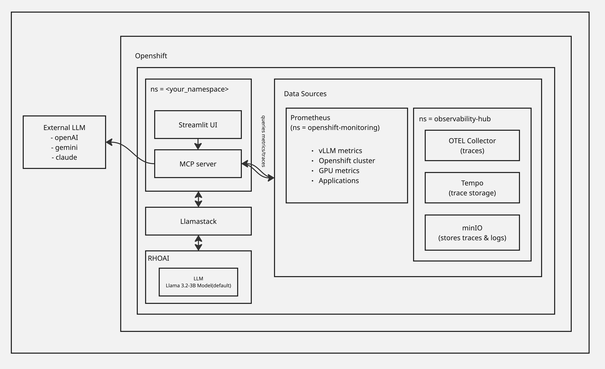
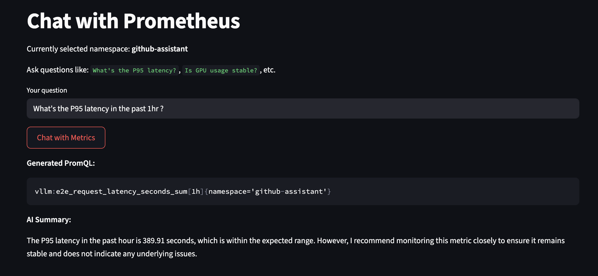

# OpenShift AI Observability Summarizer

**Monitor your AI models the smart way.** Get instant answers about performance, costs, and problems—in plain English, not technical jargon.

Ask questions like "How is my GPU performing?" or "Why is my model slow?" and get clear, actionable insights from your OpenShift AI infrastructure.

[](https://www.cncf.io/)

## Detailed description

The OpenShift AI Observability Summarizer is an intelligent monitoring platform that transforms complex infrastructure metrics into actionable business insights. Built specifically for OpenShift AI environments, it provides real-time visibility into GPU utilization, model performance, and operational costs through an intuitive conversational interface.

This platform combines advanced AI analysis with comprehensive observability to help organizations optimize their AI infrastructure investments. Instead of drowning in thousands of raw metrics, users can simply ask questions in natural language and receive intelligent, context-aware responses about their AI workloads.

Key capabilities include automated performance analysis, predictive cost optimization, intelligent alerting, and seamless integration with existing OpenShift monitoring infrastructure. The system leverages Llama 3.2-3B for AI-powered insights and supports both real-time monitoring and historical trend analysis.

Perfect for AI operations teams, platform engineers, and business stakeholders who need to understand and optimize their AI infrastructure without becoming metrics experts.

### Architecture diagrams



## Requirements

| **Category** | **Component** | **Minimum** | **Recommended** |
|--------------|---------------|-------------|-----------------|
| **Hardware** | CPU Cores | 4 cores | 8 cores |
|              | Memory | 8 Gi RAM | 16 Gi RAM |
|              | Storage | 20Gi | 50Gi |
|              | GPU | Optional | GPU nodes (for DCGM metrics) |
| **Software** | OpenShift | 4.16.24 or later | 4.16.24 or later |
|              | OpenShift AI | 2.16.2 or later | 2.16.2 or later |
|              | Service Mesh | Red Hat OpenShift Service Mesh | Red Hat OpenShift Service Mesh |
|              | Serverless | Red Hat OpenShift Serverless | Red Hat OpenShift Serverless |
| **Tools** | CLI | `oc` CLI | `oc` CLI + `helm` v3.x + `yq` |
|           | Monitoring | Prometheus/Thanos | Prometheus/Thanos |
| **Permissions** | User Access | Standard user with project admin | Standard user with project admin |
| **Optional** | GPU Monitoring | - | DCGM exporter |
|              | Alerting | - | Slack Webhook URL |
|              | Tracing | - | OpenTelemetry + Tempo Operators |


## Deploy

### Installing the OpenShift AI Observability Summarizer

Use the included `Makefile` to install everything:
```bash
make install NAMESPACE=your-namespace
```
This will install the project with the default LLM deployment, `llama-3-2-3b-instruct`.

### Using an Existing Model

To use an existing model instead of deploying a new one, specify `LLM_URL` as the model service URL:

```bash
# URL with port (no processing applied)
make install LLM_URL=http://llama-3-2-3b-instruct-predictor.dev.svc.cluster.local:8080/v1 NAMESPACE=your-namespace

# URL without port (automatically adds :8080/v1)
make install LLM_URL=http://llama-3-2-3b-instruct-predictor.dev.svc.cluster.local NAMESPACE=your-namespace
```

**URL Processing**: If the `LLM_URL` doesn't contain a port (`:PORT` format), the system will automatically append `:8080/v1` to the URL. This simplifies configuration while maintaining flexibility for custom ports.

**Token Management**: When `LLM_URL` is specified, the system will not prompt for a Hugging Face token since you're using an existing model that doesn't require new model deployment.

This is useful when:
- You already have a model deployed in your cluster
- You want to share a model across multiple namespaces
- You prefer not to deploy redundant model instances
- You want to avoid unnecessary token prompts for external models

### Choosing different models

To see all available models:
```bash
make list-models
```
```
(Output)
model: llama-3-1-8b-instruct (meta-llama/Llama-3.1-8B-Instruct)
model: llama-3-2-1b-instruct (meta-llama/Llama-3.2-1B-Instruct)
model: llama-3-2-1b-instruct-quantized (RedHatAI/Llama-3.2-1B-Instruct-quantized.w8a8)
model: llama-3-2-3b-instruct (meta-llama/Llama-3.2-3B-Instruct)
model: llama-3-3-70b-instruct (meta-llama/Llama-3.3-70B-Instruct)
model: llama-guard-3-1b (meta-llama/Llama-Guard-3-1B)
model: llama-guard-3-8b (meta-llama/Llama-Guard-3-8B)
```
You can use the `LLM` flag during installation to set a model from this list for deployment:
```
make install NAMESPACE=your-namespace LLM=llama-3-2-3b-instruct 
```

### With GPU tolerations
```bash
make install NAMESPACE=your-namespace LLM=llama-3-2-3b-instruct LLM_TOLERATION="nvidia.com/gpu"
```

### With safety models
```bash
make install NAMESPACE=your-namespace \
  LLM=llama-3-2-3b-instruct LLM_TOLERATION="nvidia.com/gpu" \
  SAFETY=llama-guard-3-8b SAFETY_TOLERATION="nvidia.com/gpu"
```

### With alerting
```bash
make install NAMESPACE=your-namespace ALERTS=TRUE
```
Enabling alerting will deploy alert rules, a cron job to monitor vLLM metrics, and AI-powered Slack notifications.

### Observability Stack Management

The project includes a complete observability stack with flexible deployment options:

#### **Complete Stack Installation**
```bash
# Install complete observability stack (MinIO + TempoStack + OTEL + tracing)
# Note: NAMESPACE is required for tracing setup
make install-observability-stack NAMESPACE=your-namespace

# Uninstall complete observability stack
# Note: NAMESPACE is required for tracing removal
make uninstall-observability-stack NAMESPACE=your-namespace
```

#### **Individual Component Management**
```bash
# Install individual components
make install-minio                                           # MinIO storage only (uses observability-hub namespace)
make install-observability                                   # TempoStack + OTEL only (uses observability-hub namespace)
make setup-tracing NAMESPACE=your-namespace                 # Auto-instrumentation only (requires NAMESPACE)

# Uninstall individual components
make uninstall-minio                                         # MinIO storage only (uses observability-hub namespace)
make uninstall-observability                                 # TempoStack + OTEL only (uses observability-hub namespace)
make remove-tracing NAMESPACE=your-namespace                 # Auto-instrumentation only (requires NAMESPACE)
```

#### **NAMESPACE Requirements**
- **Complete Stack**: `install-observability-stack` and `uninstall-observability-stack` require NAMESPACE for tracing components
- **Storage & Core**: `install-minio`, `uninstall-minio`, `install-observability`, `uninstall-observability` use hardcoded `observability-hub` namespace
- **Tracing Only**: `setup-tracing` and `remove-tracing` require NAMESPACE parameter

#### **Observability Features**
- **MinIO**: S3-compatible object storage for trace data and log data
- **TempoStack**: Multitenant trace storage and analysis
- **OpenTelemetry Collector**: Distributed tracing collection
- **Auto-instrumentation**: Automatic Python application tracing

### Accessing the Application

The default configuration deploys:
- **llm-service** - LLM inference
- **llama-stack** - Backend API
- **pgvector** - Vector database
- **metric-ui** - Multi-dashboard Streamlit interface
- **mcp-server** - Model Context Protocol server for metrics analysis, report generation, and AI assistant integration
- **OpenTelemetry Collector** - Distributed tracing collection
- **Tempo** - Trace storage and analysis
- **MinIO** - Object storage for traces

Navigate to your **OpenShift Cluster → Networking → Routes** to find the application URL(s). You can also navigate to **Observe → Traces** in the OpenShift console to view traces.

On terminal you can access the route with:

```bash
oc get route

NAME              HOST/PORT                                                               PATH   SERVICES        PORT   TERMINATION     WILDCARD
metric-ui-route   metric-ui-route-llama-1.apps.tsisodia-spark.2vn8.p1.openshiftapps.com          metric-ui-svc   8501   edge/Redirect   None
```

### OpenShift Summarizer Dashboard 


### vLLM Summarizer Dashboard 


### Chat with Prometheus 


### Report Generated 


To uninstall:

```bash
make uninstall NAMESPACE=your-namespace
```

### References

* Built on [Prometheus](https://prometheus.io/) and [Thanos](https://thanos.io/) for metrics collection
* Uses [vLLM](https://github.com/vllm-project/vllm) for model serving
* Powered by [Streamlit](https://streamlit.io/) for the web interface
* Integrates with [OpenTelemetry](https://opentelemetry.io/) for distributed tracing

## Tags

* **Industry:** Cross-industry
* **Product:** OpenShift AI
* **Use case:** AI Operations, Observability, Monitoring
