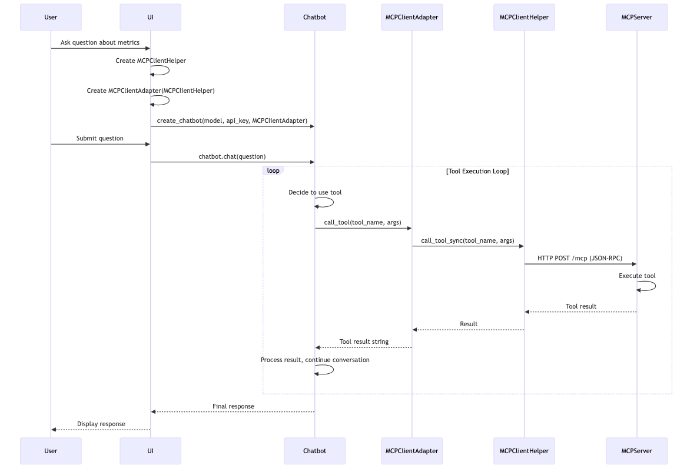
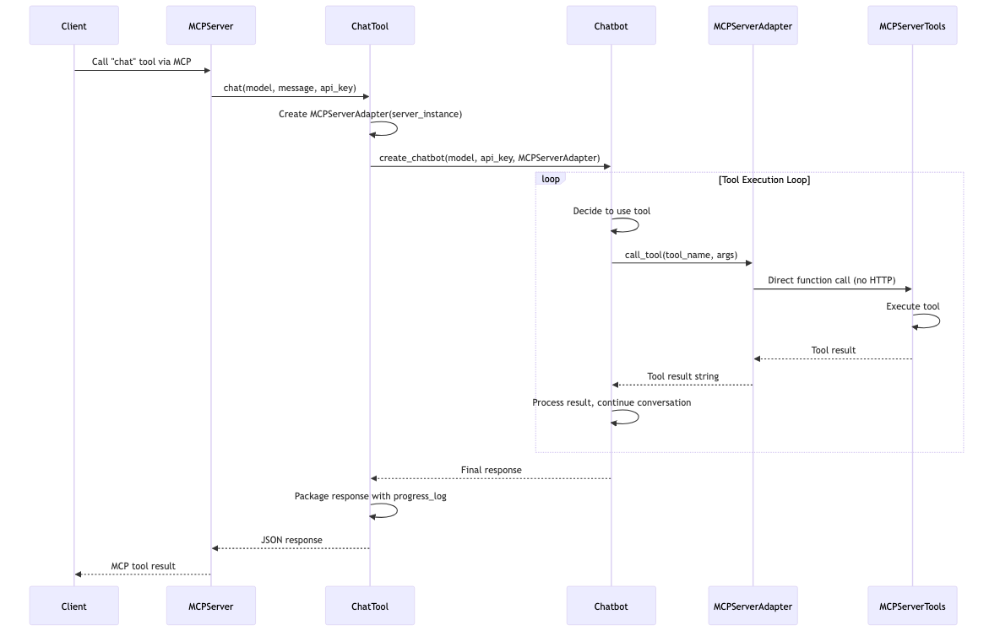
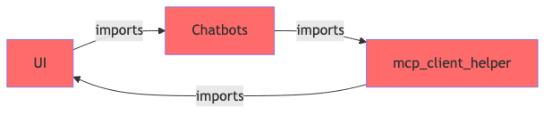
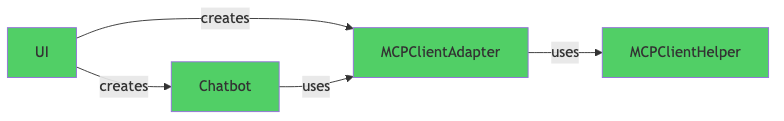

# Chatbots Architecture & Usage Guide

## Overview

The chatbots module provides a unified interface for interacting with AI models (both local and cloud-based) to enable natural language queries across the observability platform. Chatbots power the **"Chat with Prometheus"** feature in the UI and can be used via the `chat` MCP tool for external clients.

Chatbots execute MCP (Model Context Protocol) tools to gather data from multiple observability sources:

- **Prometheus metrics** - Query metrics using PromQL
- **Tempo traces** - Analyze distributed traces
- **OpenShift metrics** - Kubernetes cluster and pod metrics
- **vLLM metrics** - AI/ML model serving metrics
- **Korrel8r** - Correlated observability data (alerts, logs, traces, metrics)

The chatbots then use AI models to provide natural language responses with contextual analysis, making observability data accessible through conversational queries.

## Quick Start

- **UI usage**: create a chatbot with the UI MCP adapter to call tools over HTTP.
- **MCP server usage**: create a chatbot with the server adapter for direct tool execution.

See `src/chatbots/README.md` for working examples and `src/mcp_server/README.md` for MCP tool usage.

## Architecture

The chatbots system uses a **ToolExecutor interface** with **Adapter pattern** implementations to decouple chatbot
implementations from the execution context. This allows chatbots to work seamlessly whether they are running in the
_UI process_ or the _MCP server process_.

- **ToolExecutor**: Abstract interface that defines how tools are executed (_dependency inversion principle_)
- **Adapter Pattern**: Implementation approach where `MCPServerAdapter` and `MCPClientAdapter` adapt different contexts to the `ToolExecutor` interface

### Key Components

- `BaseChatBot` implementations (provider-specific)
- `ToolExecutor` interface
- Adapters for UI (`MCPClientAdapter`) and MCP server (`MCPServerAdapter`)

## Usage Patterns

### 1. Usage from UI

The UI creates chatbots directly and uses them to answer user questions about observability data.

#### Sequence Diagram

#### Key Points

- **Location**: Chatbots run in the UI process (Streamlit)
- **Tool Execution**: Tools are executed via MCP protocol (HTTP/JSON-RPC)
- **Adapter**: `MCPClientAdapter` wraps `MCPClientHelper` to provide `ToolExecutor` interface
- **Benefits**: UI can use chatbots without importing MCP server code

### 2. Usage from `chat` MCP Tool

The `chat` MCP tool allows external clients to use chatbots through the MCP protocol. This is useful for CLI tools, other services, or any MCP-compatible client.

#### Sequence Diagram

#### Key Points

- **Location**: Chatbots run in the MCP server process
- **Tool Execution**: Tools are executed directly (no HTTP overhead)
- **Adapter**: `MCPServerAdapter` wraps the server instance for direct tool access
- **Benefits**: Lower latency, no network overhead, progress tracking included

## Architecture Evolution: Resolving Circular Dependencies

This section documents the architectural refactoring that introduced the **ToolExecutor interface** and **Adapter pattern** to eliminate circular dependencies and enable flexible chatbot usage across different execution contexts.

### Previous Architecture

The initial implementation had chatbots located within the MCP server package with direct dependencies on server components.

#### Original Design

**Location**: Chatbots lived in `src/mcp_server/chatbots/` (inside the server package)

**How the circular dependency occurred:**

1. UI imports chatbots from `mcp_server.chatbots` package
2. Chatbots need to execute MCP tools
3. Chatbots import `mcp_client_helper` from the `ui/` directory (using dynamic import with sys.path manipulation)
4. This creates: **UI → mcp_server.chatbots → ui.mcp_client_helper → UI** (circular!)

**Characteristics of this design:**

1. Chatbots located in `mcp_server` package but depend on UI code
2. Dynamic import with sys.path manipulation to access UI modules
3. Chatbots use `MCPClientHelper` from UI to call MCP server
4. Creates circular dependency: UI imports from mcp_server, mcp_server imports from UI
5. Tight coupling between server and UI packages

**Code structure:** See `src/mcp_server/chatbots/` for the original layout.

**Limitations of this approach:**

- **Circular dependency**: UI imports from `mcp_server.chatbots`, chatbots import from `ui/`
- **Dynamic sys.path manipulation**: Chatbots modify Python path at runtime to access UI modules
- Chatbots tightly coupled to both `mcp_server` and `ui` packages
- UI depends on server package, server depends on UI package
- Brittle import mechanism relying on directory structure
- Chatbots cannot work in different execution contexts
- Testing requires both MCP server and UI infrastructure
- No way to use alternative tool execution mechanisms

#### Architecture Diagram (Original)

### Current Architecture

The refactored design introduces a **ToolExecutor interface** with **Adapter pattern** implementations and **dependency injection**.

#### Improved Design

**Location**: Chatbots now live in standalone `src/chatbots/` package

**Import Chain** (UI): Chatbots package → ToolExecutor → MCPClientAdapter.

**Import Chain** (MCP Server): Chatbots package → ToolExecutor → MCPServerAdapter.

**Current code structure:** See `src/chatbots/` for the refactored layout.

**Improvements in this approach:**

- Chatbots in standalone package, decoupled from server implementation
- Dependency injection enables flexible tool execution
- Clean separation between UI and server concerns
- Chatbots work in multiple contexts (UI, MCP server, tests)
- Easy to test with mock implementations
- Eliminates circular dependencies
- Follows SOLID principles (Dependency Inversion)

#### Architecture Diagram (Refactored)

### Key Changes

1. **Introduced `ToolExecutor` Interface** (Dependency Inversion Pattern)

   - Abstract interface in `chatbots/tool_executor.py`
   - Chatbots depend on interface, not concrete implementations
   - Defines contract: `call_tool()`, `list_tools()`, `get_tool()`

2. **Created Adapter Implementations** (Adapter Pattern)

   - `MCPClientAdapter` (in `ui/mcp_client_adapter.py`) - adapts `MCPClientHelper` to `ToolExecutor` interface for UI context
   - `MCPServerAdapter` (in `mcp_server/mcp_tools_adapter.py`) - adapts `ObservabilityMCPServer` to `ToolExecutor` interface for MCP server context
   - Both implement the `ToolExecutor` interface but use different underlying mechanisms

3. **Dependency Injection**

   - Chatbots receive `ToolExecutor` via constructor (dependency injection)
   - No direct imports of MCP server or client in chatbots
   - Chatbots only depend on the `ToolExecutor` abstraction

4. **Moved Utilities to Common**

   - `extract_text_from_mcp_result` moved to `common/mcp_utils.py`
   - Breaks circular dependency on UI-specific code
   - Shared utilities accessible from both UI and server contexts

5. **Relocated Chatbots Package**
   - Moved from `src/mcp_server/chatbots/` to `src/chatbots/`
   - Now a standalone package independent of MCP server

### Architecture Summary

The refactor moved chatbots into a standalone package and introduced the `ToolExecutor` interface so the UI and MCP server can each provide their own adapter for tool execution.

## Supported Models

The chatbot factory (`chatbots/factory.py`) supports multiple AI providers:

### External Providers

- **Anthropic**: Claude models (e.g., `anthropic/claude-3-5-sonnet-20241022`)
- **OpenAI**: GPT models (e.g., `openai/gpt-4o-mini`)
- **Google**: Gemini models (e.g., `google/gemini-2.0-flash`)

### Local Models

- **Llama 3.1/3.3**: Uses `LlamaChatBot` (tool calling capable)
- **Llama 3.2**: Uses `DeterministicChatBot` (deterministic parsing)
- **Unknown Models**: Falls back to `DeterministicChatBot`

## Tool Execution

Chatbots can execute any MCP tool available on the server. Common tools include:

- `search_metrics`: Pattern-based metric search
- `execute_promql`: Execute PromQL queries
- `get_metric_metadata`: Get metric details
- `get_label_values`: Get available label values
- `suggest_queries`: Get PromQL suggestions
- `explain_results`: Human-readable explanations
- `korrel8r_query_objects`: Query observability objects
- `korrel8r_get_correlated`: Get correlated data

## Best Practices

1. **Always Provide Tool Executor**: Chatbots require a `ToolExecutor` instance.

2. **Use Appropriate Adapter**: Choose the right adapter for your context

   - UI process → `MCPClientAdapter`
   - MCP server process → `MCPServerAdapter`

3. **Handle Progress Callbacks**: Use progress callbacks for better UX.

4. **Namespace Filtering**: Use namespace parameter for scoped queries.

## Related Documentation

- [MCP Server README](../src/mcp_server/README.md) - MCP server setup and configuration
- [Observability Overview](OBSERVABILITY_OVERVIEW.md) - Overall system architecture
- [Developer Guide](DEV_GUIDE.md) - Development setup and workflows

## Further Documentation

For runnable examples and full setup steps, see:
- `src/chatbots/README.md`
- `src/mcp_server/README.md`
